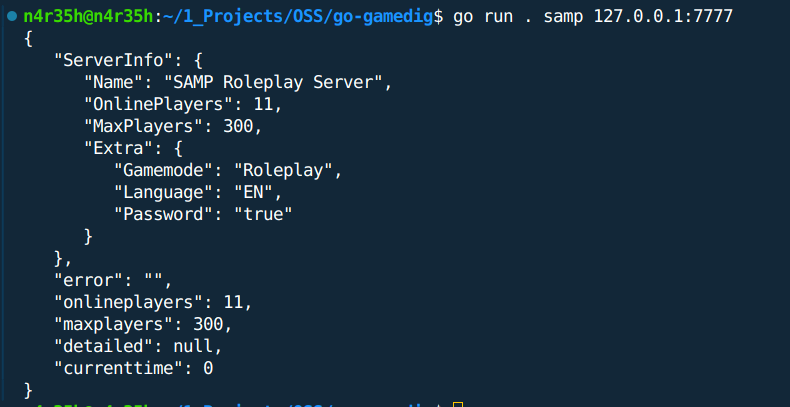

#Usage

### as a cli tool

```sh
# <binary> <game_type> <hostname (ip:port)>
go run . samp 127.0.0.1:7777
# or
gogamedig samp 127.0.0.1:7777
```



### as a library inside your golang project

```sh
go get github.com/N4r35h/go-gamedig
```

### Supported Games

| Game Type      | Name                                                             |
| -------------- | ---------------------------------------------------------------- |
| samp           | Grand Theft Auto: San Andreas - SA-MP (San Andreas Multi Player) |
| fivem          | Grand Theft Auto V - FiveM                                       |
| minecraft      | Minecraft                                                        |
| ark            | Ark: Survival Evolved                                            |
| spaceengineers | Space Engineers                                                  |
| 7d2d           | 7 Days to Die                                                    |
| tf2            | Team Fortress 2                                                  |
| unturned       | Unturned                                                         |
| csgo           | Counter-Strike: Global Offensive                                 |
| mta            | Grand Theft Auto: San Andreas - MTA (Multi Theft Auto)           |
| vcmp           | Vice City Muliplayer                                             |
| gtac           | GTA Connected                                                    |
